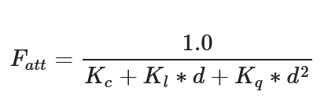
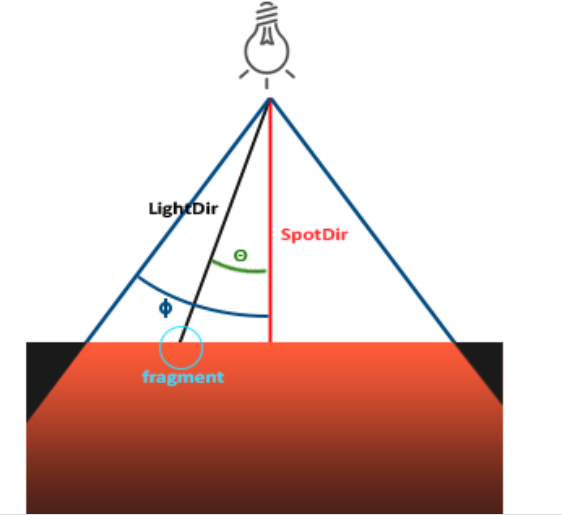

# 什么是OPENGL
1. 它仅仅是一个由Khronos组织制定并维护的规范(Specification)。
2. 严格规定了每个函数该如何执行，以及它们的输出值
3. 实际的OpenGL库的开发者通常是显卡的生产商

# 核心模式和立即模式
1. 早期的OpenGL使用立即渲染模式，固定渲染管线，不够灵活
2. 3.2开始使用核心模式：灵活效率高
3. 使用3.3因为核心架构没变

# 其他
1. 扩展：使用硬件支持的全新的现代特性

# 入门

## 窗口
### 关于glew-glad / glfw的实际工作
GLFW 提供 OpenGL, OpenGL ES 和 Vulkan 的桌面开发环境，是一个跨平台的开源库。
利用它可以创建窗口、处理键盘鼠标等事件。windows下它使用win32 api创建窗口，WGL关联OPENGL上下文。
Linux 下使用 X11创建窗口，GLX关联OPENGL上下文。MAC下使用cocoa创建窗口，AGL关联OPENGL上下文。
GLAD 的功能比较专一，专门加载OpenGL的函数指针。

窗口类的都是glfw..()，而实际渲染相关的代码是gl..()

## 三角形
### 管线
图形渲染管线接受一组3D坐标，通过着色器将之转变屏幕上的有色2D像素输出。
OpenGL着色器是用OpenGL着色器语言(OpenGL Shading Language, GLSL)写成的。

顶点着色器-形状装配-几何着色器-光栅化-片段着色器-测试与混合

1. **顶点着色器**(Vertex Shader)主要的目的是把3D坐标转为标准化设备坐标，同时顶点着色器允许我们对顶点属性进行一些基本处理。
2. **图元装配**(Primitive Assembly)阶段将顶点着色器输出的所有顶点作为输入（如果是GL_POINTS，那么就是一个顶点），并所有的点装配成指定图元的形状
3. **几何着色器**(Geometry Shader)把图元形式的一系列顶点的集合作为输入，它可以通过产生新顶点构造出新的（或是其它的）图元来生成其他形状。
4. **光栅化阶段**(Rasterization Stage)，这里它会把图元映射为最终屏幕上相应的像素，生成供片段着色器(Fragment Shader)使用的片段(Fragment)。
5. **裁切**(Clipping)。裁切会丢弃超出你的视图以外的所有像素，用来提升执行效率。
6. **片段着色器**的主要目的是计算一个像素的最终颜色，这也是所有OpenGL高级效果产生的地方。通常，片段着色器包含3D场景的数据（比如光照、阴影、光的颜色等等），这些数据可以被用来计算最终像素的颜色。
7. 在所有对应颜色值确定以后，最终的对象将会被传到最后一个阶段，我们叫做Alpha测试和混合(Blending)阶段。这个阶段检验某个像素深度以判断是否改被丢弃，并检查alpha值以混合。
### VBO
顶点缓冲对象存储顶点信息。每个类型可以绑定一个vbo
### 两个着色器的编译
我们需要自己写顶点着色器和几何着色器。
### 着色器程序
多个着色器合并之后并最终链接完成的版本
### 链接顶点属性
### VAO
可以像顶点缓冲对象那样被绑定，任何随后的顶点属性调用都会储存在这个VAO中。当配置顶点属性指针时，你只需要将那些调用执行一次，之后再绘制物体的时候只需要绑定相应的VAO就行了.
VAO也会自动绑定IBO

### GLSL
着色器的开头总是要声明版本，接着是输入和输出变量、uniform和main函数。

每个输入变量也叫顶点属性(Vertex Attribute)
### 数据类型
int、float、double、uint和bool，vector和matrix

#### vector

类型 	含义
vecn 	包含n个float分量的默认向量
bvecn 	包含n个bool分量的向量
ivecn 	包含n个int分量的向量
uvecn 	包含n个unsigned int分量的向量
dvecn 	包含n个double分量的向量

向量允许重组：vec4 otherVec = someVec.xxxx + anotherVec.yxzy;

### I/O
语法：
in/out type name;
每一级shader的out会进入下一级作为in，需要名称和类型相同。
对于顶点缓冲区，特别地需要layout(index)以表达顶点属性输入。
### uniform 变量
uniform type name; 此名称是全局的，并能够从cpu函数中修改。

## 纹理
我们需要指定三角形的每个顶点各自对应纹理的哪个部分。这样每个顶点就会关联着一个纹理坐标(Texture Coordinate)，用来标明该从纹理图像的哪个部分采样。之后在图形的其它片段上进行片段插值(Fragment Interpolation)。

将纹理的像素texel映射为纹理坐标的过程称作纹理过滤，以使其分辨率无关。
GL_NEAREST（也叫邻近过滤，Nearest Neighbor Filtering）是OpenGL默认的纹理过滤方式。
GL_LINEAR（也叫线性过滤，(Bi)linear Filtering）它会基于纹理坐标附近的纹理像素，计算出一个插值。
### 多级渐远纹理
为了形成远近清晰和模糊的分野，使用此方法

### 纹理单元
通过给sample2D变量（采样器）赋值设置多个纹理。一个纹理的位置值通常称为一个纹理单元。
## 变换
此章节内容参阅一般的图形学教材
## 坐标系统
比较重要的总共有5个不同的坐标系统：

    局部空间(Local Space，或者称为物体空间(Object Space))
    世界空间(World Space)
    观察空间(View Space，或者称为视觉空间(Eye Space))
    裁剪空间(Clip Space)
    屏幕空间(Screen Space)

1. 局部坐标是对象相对于局部原点的坐标，也是物体起始的坐标。
2. 下一步是将局部坐标变换为世界空间坐标，世界空间坐标是处于一个更大的空间范围的。这些坐标相对于世界的全局原点，它们会和其它物体一起相对于世界的原点进行摆放。
3. 接下来我们将世界坐标变换为观察空间坐标，使得每个坐标都是从摄像机或者说观察者的角度进行观察的。
4. 坐标到达观察空间之后，我们需要将其投影到裁剪坐标。裁剪坐标会被处理至-1.0到1.0的范围内，并判断哪些顶点将会出现在屏幕上。
5. 最后，我们将裁剪坐标变换为屏幕坐标，我们将使用一个叫做视口变换(Viewport Transform)的过程。视口变换将位于-1.0到1.0范围的坐标变换到由glViewport函数所定义的坐标范围内。最后变换出来的坐标将会送到光栅器，将其转化为片段。

### 局部空间
局部坐标即对象内部所使用的坐标
### 世界空间
众物体所在的空间。由局部空间到世界空间的变换是通过模型矩阵实现的。

模型矩阵是一种变换矩阵，它能通过对物体进行位移、缩放、旋转来将它置于它本应该在的位置或朝向。
### 观察空间
观察空间经常被人们称之OpenGL的摄像机(Camera)（所以有时也称为摄像机空间(Camera Space)或视觉空间(Eye Space)）。观察空间是将世界空间坐标转化为用户视野前方的坐标而产生的结果。因此观察空间就是**从摄像机的视角所观察到的空间**。而这通常是由一系列的位移和旋转的组合来完成，平移/旋转场景从而使得特定的对象被变换到摄像机的前方。这些组合在一起的变换通常存储在一个**观察矩阵**(View Matrix)里，它被用来将世界坐标变换到观察空间。
### 裁剪空间
（投影+归一化）
顶点着色器最后，期望所有的坐标都能落在一个特定的范围内，且任何在这个范围之外的点都应该被裁剪掉(Clipped)。被裁剪掉的坐标就会被忽略，所以剩下的坐标就将变为屏幕上可见的片段。这也就是裁剪空间(Clip Space)名字的由来。

我们会指定自己的坐标集(Coordinate Set)并将它变换回标准化设备坐标系，为了将顶点坐标从观察变换到裁剪空间，我们需要定义一个**投影矩阵**(Projection Matrix)，它指定了一个范围的坐标，比如在每个维度上的-1000到1000。投影矩阵接着会将在这个指定的范围内的坐标变换为标准化设备坐标的范围(-1.0, 1.0)。所有在范围外的坐标不会被映射到在-1.0到1.0的范围之间，所以**会被裁剪掉**。在上面这个投影矩阵所指定的范围内，坐标(1250, 500, 750)将是不可见的，这是由于它的x坐标超出了范围，它被转化为一个大于1.0的标准化设备坐标，所以被裁剪掉了。

由投影矩阵创建的观察箱(Viewing Box)被称为**平截头体**(Frustum)，每个出现在平截头体范围内的坐标都会最终出现在用户的屏幕上。将特定范围内的坐标转化到标准化设备坐标系的过程（而且它很容易被映射到2D观察空间坐标）被称之为**投影**(Projection)，因为使用投影矩阵能将3D坐标投影(Project)到很容易映射到2D的标准化设备坐标系中。
#### 投影：正射投影

#### 投影：透视投影

透视矩阵的求法参见http://www.songho.ca/opengl/gl_projectionmatrix.html

glm提供了perspective方法来求。
## 观察矩阵
lookat矩阵形如
，可以看出这个矩阵的作用是两部分：对原空间中的某个点P，

1. （先进行）右部分是平移使原空间和摄像机空间原点重合，因为摄像机的原点(Px,Py,Pz)变换之后成为0；
2. （再进行）换基。左边矩阵实际是基变换矩阵的转置（因为他是正规的，也是逆），以变换坐标。     

glm提供了lookAt方法来求。
# 光照
## 颜色
定义物体的颜色为物体从一个光源反射各个颜色分量的大小，
## 基础光照
phone模型：

    环境光照(Ambient Lighting)：即使在黑暗的情况下，世界上通常也仍然有一些光亮（月亮、远处的光），所以物体几乎永远不会是完全黑暗的。为了模拟这个，我们会使用一个环境光照常量，它永远会给物体一些颜色。
    漫反射光照(Diffuse Lighting)：模拟光源对物体的方向性影响(Directional Impact)。它是冯氏光照模型中视觉上最显著的分量。物体的某一部分越是正对着光源，它就会越亮。
    镜面光照(Specular Lighting)：模拟有光泽物体上面出现的亮点。镜面光照的颜色相比于物体的颜色会更倾向于光的颜色。
### 环境光照
1. 全局照明算法：考虑光的反射，代价高昂
2. 简化的模型：只用一个环境光强系数ambientStrength
### 漫反射
公式是 max(norm*lightDirection,0)， 即max(LN,0)。

注意需要对法向量做一个修正，即左乘model矩阵变换部分的转置的逆。这件事可以轻松地利用他两点乘是0推导。
### 镜面反射

公式是：max(reflect(lightdirection)*viewdirecton,0)再取一个反光度次幂，这个幂越大高光越小。

### 提示
光对这三种过程也应该具有不同的强度。

## 材质
在上述的phone过程中，我们定义了objectColor以表示物体的颜色。更加精细的做法是规定物体在环境光、漫反射和镜面反射时具有的不同的颜色向量。具体的说：

1. ambient材质向量定义了在环境光照下这个表面反射的是什么颜色，通常与表面的颜色相同。
2. diffuse材质向量定义了在漫反射光照下表面的颜色。漫反射颜色（和环境光照一样）也被设置为我们期望的物体颜色。
3. specular材质向量设置的是表面上镜面高光的颜色（或者甚至可能反映一个特定表面的颜色）。
4. shininess影响镜面高光的散射/半径。实际上就是上节课中说的幂。

## 光照贴图
一个物体具有多种材质的情况下需要引入新的贴图：漫反射（间接地，环境光）和镜面光贴图。漫反射贴图就是物体表面的颜色，也就是最开始介绍的贴图。镜面反射贴图主要对高光有用。

## 投光物
不同的光源产生有几种不同的光：距离无限远导致的平行光，比如太阳。或者一个点光源像四处发出衰减的光，光强公式满足
d代表了片段距光源的距离。接下来为了计算衰减值，我们定义3个（可配置的）项：常数项Kc、一次项Kl和二次项Kq

。

    常数项通常保持为1.0，它的主要作用是保证分母永远不会比1小，否则的话在某些距离上它反而会增加强度，这肯定不是我们想要的效果。
    一次项会与距离值相乘，以线性的方式减少强度。
    二次项会与距离的平方相乘，让光源以二次递减的方式减少强度。二次项在距离比较小的时候影响会比一次项小很多，但当距离值比较大的时候它就会比一次项更大了。
第三种光是聚光。它的光源只朝一个特定方向而不是所有方向照射光线。

    LightDir：从片段指向光源的向量。
    SpotDir：聚光所指向的方向。
    phi：指定了聚光半径的切光角。落在这个角度之外的物体都不会被这个聚光所照亮。
    theta：LightDir向量和SpotDir向量之间的夹角。在聚光内部的话θ值应该比ϕ值小。否则，使用
环境光。为了计算这点，使用一个cutoff定义为cos(phi)，如果内积比这个小就说明不在范围内。

聚光还需要考虑一个平滑的边缘。为此设置一组内外圆锥，外圆锥夹角gamma角度大于内圆锥夹角（一般设置为上文的phi）的
光得到新的强度I = cos(theta) - cos(phi) / cos(theta) - cos(gamma),换言之就是根据cos的差值。而cos
实际上就是两边向量内积。

# 高级opengl内容
## 深度测试
在大部分的系统中，深度缓冲的精度都是24位的。当深度测试(Depth Testing)被启用的时候，OpenGL会将一个**片段**的深度值与深度缓冲的内容进行对比。
OpenGL会执行一个深度测试，如果这个测试通过了的话，深度缓冲将会**更新为新的深度值**。如果深度测试失败了，片段将会被丢弃。
测试是在片段着色器以及模板测试(Stencil Testing)运行之后在屏幕空间中运行的。
屏幕空间坐标与通过OpenGL的glViewport所定义的视口密切相关，
并且可以直接使用GLSL内建变量gl_FragCoord从片段着色器中直接访问。
gl_FragCoord的x和y分量代表了片段的屏幕空间坐标（其中(0, 0)位于左下角）。
gl_FragCoord中也包含了一个**z分量，它包含了片段真正的深度值。**
z值就是需要与深度缓冲内容所对比的那个值。

现在大部分的GPU都提供一个叫做提前深度测试(Early Depth Testing)的硬件特性。提前深度测试允许深度测试在片段着色器之前运行。只要我们清楚一个片段永远不会是可见的（它在其他物体之后），我们就能提前丢弃这个片段。

一个例子是，如果深度测试的行为是“全部通过”，那么后渲染的物体会通过并且成为新的深度值，所以最后绘制的片段将会总是会渲染在之前绘制片段的上面

从投影矩阵来看，深度值（也是精度）与z呈现出非线性的关系，与1/z更近似。这个值是从[-1,1]\(NDC\)变化来的，即（NDC + 1）/2.

//使用glDepthFunc设置深度测试通过方式，默认GL_Less（在片段深度值小于缓冲的深度值时通过测试）

//glDepthFunc(GL_LESS);

### 防止深度冲突
摆的很近的时候深度缓冲没有足够的精度来决定两个形状哪个在前面，结果就是这两个形状不断地在切换前后顺序，这会导致很奇怪的花纹。
1. 永远不要把多个物体摆得太靠近，以至于它们的一些三角形会重叠。
2. 尽可能将近平面设置远一些。
3. 使用更高精度的深度缓冲。

## 模板测试
当片段着色器处理完一个片段之后，模板测试(Stencil Test)会开始执行，使用模板缓冲并可能会丢弃片段。一个模板缓冲中，（通常）每个模板值(Stencil Value)是8位的。所以每个像素/片段一共能有256种不同的模板值。

// 设置模板掩码在写入缓冲区时计算

// glStencilMask(0xFF); // 每一位写入模板缓冲时都保持原样

//glStencilMask(0x00); // 每一位在写入模板缓冲时都会变成0（禁用写入）

// 通过方式/参考值/掩码

// glStencilFunc(GL_EQUAL, 1, 0xFF);

// glStencilOp 设置测试的后果.具体参阅教程
### 物体轮廓
模板测试能够实现的一个功能是物体轮廓，过程如下：

    在绘制（需要添加轮廓的）物体之前，将模板函数设置为GL_ALWAYS，每当物体的片段被渲染时，将模板缓冲更新为1。
    渲染物体。
    禁用模板写入以及深度测试。
    将每个物体缩放一点点。
    使用一个不同的片段着色器，输出一个单独的（边框）颜色。
    再次绘制物体，但只在它们片段的模板值不等于1时才绘制。
    再次启用模板写入和深度测试。

## 混合
混合(Blending)通常是实现物体透明度(Transparency)的一种技术。透明就是说一个物体（或者其中的一部分）不是纯色(Solid Color)的，它的颜色是物体本身的颜色和它背后其它物体的颜色的不同强度结合。

一个物体的透明度是通过它颜色的alpha值来决定的。alpha即不透明度。其方程就是简单的
color = alpha1\*color1 + (1-alpha1)\*color2，但是opengl使用
color = F1\*color1 + F2\*color2，这个F是一个因子表征着颜色或者alpha等等对颜色的影响，使用glBlendFunc设置。

Tips:
，当采样纹理的边缘的时候，OpenGL会对边缘的值和纹理下一个重复的值进行插值（因为我们将它的环绕方式设置为了GL_REPEAT。这通常是没问题的，但是由于我们使用了透明值，纹理图像的顶部将会与底部边缘的纯色值进行插值。
这样的结果是一个半透明的有色边框,使用GL_CLAMP_TO_EDGE对GL_TEXTURE_WRAP_S。

// 公式1 即glBlendFunc(GL_SRC_ALPHA, GL_ONE_MINUS_SRC_ALPHA);

 为了解决混合与深度测试冲突的问题，从后向前渲染。

## 面剔除
提升渲染效率可以丢弃一些不可见面。规定一个对于观察者渲染的方向是正向，比如默认的逆时针，
他的背面的图元将以顺时针方向渲染。函数是
glEnable(GL_CULL_FACE);
glCullFace(GL_FRONT);

## 帧缓冲
其实就是屏幕显示画面的缓冲，换句话说缓冲结合起来叫做帧缓冲(Framebuffer)，它被储存在内存中。
目前所做的所有操作都是在窗口给我们建立的默认帧缓冲的渲染缓冲上进行的。实际上我们还可以自己建立
一些帧缓冲方便用。

一个完整的帧缓冲需要满足以下的条件：

    附加至少一个缓冲（颜色、深度或模板缓冲）。
    至少有一个颜色附件(Attachment)。
    所有的附件都必须是完整的（保留了内存）。
    每个缓冲都应该有相同的样本数。
   **附件**是一个内存位置，它能够作为帧缓冲的一个缓冲，可以将它想象为一个图像（颜色图，深度图，模型图……）。
    创建一个附件的时候我们有两个选项：纹理或渲染缓冲对象。

完成之后，调用glCheckFramebufferStatus，检查帧缓冲是否完整。成功之后渲染操作就可以在附件当中进行而不再在默认帧缓冲屏幕上进行，
因此这种方式也被称为离屏渲染(Off-screen Rendering)。

离屏渲染之后，如果想要让屏幕呈现结果只相当于绘制已经做好存放在附件中的贴图四边形（长方形）而已。因此，他不需要深度测试。
切换回默认的framebuffer之后再使用一个coord = (posx,posy, 0, 1)和color = texture(coord)的着色器渲染6个顶点即可。
### 纹理附件
把一个纹理（颜色/ 深度/ 模板) 附加到帧缓冲的时候，所有的渲染指令将会写入到这个纹理中，就像它是一个普通的颜色/深度或模板缓冲一样，
结果是所有渲染操作的结果将会被储存在一个纹理图像中，我们之后可以在着色器中很方便地使用它。创建纹理时我们绑定null，并
（一般）设置大小为视口大小。
并用glFramebufferTexture2D附着给帧缓冲。

### 渲染缓冲对象附件
他是在纹理之后引入到OpenGL中的。
render buffers这种对象也能像纹理附件一样渲染，但他会将数据储存为OpenGL原生的渲染格式，不会做任何针对纹理格式的转换，因此更快。

因为它的数据已经是原生的格式了，当写入或者复制它的数据到其它缓冲中时是非常快的。
所以，交换缓冲这样的操作在使用渲染缓冲对象时会非常快。我们在每个渲染迭代最后使用的glfwSwapBuffers，
也可以通过渲染缓冲对象实现：只需要写入一个渲染缓冲图像，并在最后交换到另外一个渲染缓冲就可以了。

### 后期处理
将一帧做成贴图之后，就可以在片段着色器中进行后期处理了。比如反相，只需要1-texture(coord)
或者让一个核作用在图像上。

一些可以使用的核参考原文。

## 正方体贴图
立方体贴图就是一个包含了6个2D纹理的纹理，每个2D纹理都组成了立方体的一个面：一个有纹理的立方体。
只需要提供一个3d向量就能获得纹理值。
### 天空盒
天空盒是一个包含了整个场景的（大）立方体，它包含周围环境的6个图像，让玩家以为他处在一个比实际大得多的环境当中。
加载时适用GL_TEXTURE_CUBE_MAP。

天空盒所使用的着色器的特点是位置向量作为输出给片段着色器的纹理坐标。
### 优化
因为首先渲染天空盒将对屏幕全部图元进行着色，更好的方式是将他放在后面渲染。实现这点的一个
方式是提前深度测试。总之我们需要
让顶点shader的最后给天空盒顶点的NDC.z = 1，即认为天空盒是最深的地方。
