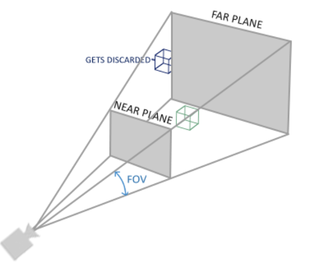

# 什么是OPENGL
1. 它仅仅是一个由Khronos组织制定并维护的规范(Specification)。
2. 严格规定了每个函数该如何执行，以及它们的输出值
3. 实际的OpenGL库的开发者通常是显卡的生产商

# 核心模式和立即模式
1. 早期的OpenGL使用立即渲染模式，固定渲染管线，不够灵活
2. 3.2开始使用核心模式：灵活效率高
3. 使用3.3因为核心架构没变

# 其他
1. 扩展：使用硬件支持的全新的现代特性

# 入门

## 窗口
### 关于glew-glad / glfw的实际工作
GLFW 提供 OpenGL, OpenGL ES 和 Vulkan 的桌面开发环境，是一个跨平台的开源库。
利用它可以创建窗口、处理键盘鼠标等事件。windows下它使用win32 api创建窗口，WGL关联OPENGL上下文。
Linux 下使用 X11创建窗口，GLX关联OPENGL上下文。MAC下使用cocoa创建窗口，AGL关联OPENGL上下文。
GLAD 的功能比较专一，专门加载OpenGL的函数指针。

窗口类的都是glfw..()，而实际渲染相关的代码是gl..()

## 三角形
### 管线
图形渲染管线接受一组3D坐标，通过着色器将之转变屏幕上的有色2D像素输出。
OpenGL着色器是用OpenGL着色器语言(OpenGL Shading Language, GLSL)写成的。

顶点着色器-形状装配-几何着色器-光栅化-片段着色器-测试与混合

1. **顶点着色器**(Vertex Shader)主要的目的是把3D坐标转为标准化设备坐标，同时顶点着色器允许我们对顶点属性进行一些基本处理。
2. **图元装配**(Primitive Assembly)阶段将顶点着色器输出的所有顶点作为输入（如果是GL_POINTS，那么就是一个顶点），并所有的点装配成指定图元的形状
3. **几何着色器**(Geometry Shader)把图元形式的一系列顶点的集合作为输入，它可以通过产生新顶点构造出新的（或是其它的）图元来生成其他形状。
4. **光栅化阶段**(Rasterization Stage)，这里它会把图元映射为最终屏幕上相应的像素，生成供片段着色器(Fragment Shader)使用的片段(Fragment)。
5. **裁切**(Clipping)。裁切会丢弃超出你的视图以外的所有像素，用来提升执行效率。
6. **片段着色器**的主要目的是计算一个像素的最终颜色，这也是所有OpenGL高级效果产生的地方。通常，片段着色器包含3D场景的数据（比如光照、阴影、光的颜色等等），这些数据可以被用来计算最终像素的颜色。
7. 在所有对应颜色值确定以后，最终的对象将会被传到最后一个阶段，我们叫做Alpha测试和混合(Blending)阶段。这个阶段检验某个像素深度以判断是否改被丢弃，并检查alpha值以混合。
### VBO
顶点缓冲对象存储顶点信息。每个类型可以绑定一个vbo
### 两个着色器的编译
我们需要自己写顶点着色器和几何着色器。
### 着色器程序
多个着色器合并之后并最终链接完成的版本
### 链接顶点属性
### VAO
可以像顶点缓冲对象那样被绑定，任何随后的顶点属性调用都会储存在这个VAO中。当配置顶点属性指针时，你只需要将那些调用执行一次，之后再绘制物体的时候只需要绑定相应的VAO就行了.
VAO也会自动绑定IBO

### GLSL
着色器的开头总是要声明版本，接着是输入和输出变量、uniform和main函数。

每个输入变量也叫顶点属性(Vertex Attribute)
### 数据类型
int、float、double、uint和bool，vector和matrix

#### vector

类型 	含义
vecn 	包含n个float分量的默认向量
bvecn 	包含n个bool分量的向量
ivecn 	包含n个int分量的向量
uvecn 	包含n个unsigned int分量的向量
dvecn 	包含n个double分量的向量

向量允许重组：vec4 otherVec = someVec.xxxx + anotherVec.yxzy;

### I/O
语法：
in/out type name;
每一级shader的out会进入下一级作为in，需要名称和类型相同。
对于顶点缓冲区，特别地需要layout(index)以表达顶点属性输入。
### uniform 变量
uniform type name; 此名称是全局的，并能够从cpu函数中修改。

## 纹理
我们需要指定三角形的每个顶点各自对应纹理的哪个部分。这样每个顶点就会关联着一个纹理坐标(Texture Coordinate)，用来标明该从纹理图像的哪个部分采样。之后在图形的其它片段上进行片段插值(Fragment Interpolation)。

将纹理的像素texel映射为纹理坐标的过程称作纹理过滤，以使其分辨率无关。
GL_NEAREST（也叫邻近过滤，Nearest Neighbor Filtering）是OpenGL默认的纹理过滤方式。
GL_LINEAR（也叫线性过滤，(Bi)linear Filtering）它会基于纹理坐标附近的纹理像素，计算出一个插值。
### 多级渐远纹理
为了形成远近清晰和模糊的分野，使用此方法

### 纹理单元
通过给sample2D变量（采样器）赋值设置多个纹理。一个纹理的位置值通常称为一个纹理单元。
## 变换
此章节内容参阅一般的图形学教材
## 坐标系统
比较重要的总共有5个不同的坐标系统：

    局部空间(Local Space，或者称为物体空间(Object Space))
    世界空间(World Space)
    观察空间(View Space，或者称为视觉空间(Eye Space))
    裁剪空间(Clip Space)
    屏幕空间(Screen Space)

1. 局部坐标是对象相对于局部原点的坐标，也是物体起始的坐标。
2. 下一步是将局部坐标变换为世界空间坐标，世界空间坐标是处于一个更大的空间范围的。这些坐标相对于世界的全局原点，它们会和其它物体一起相对于世界的原点进行摆放。
3. 接下来我们将世界坐标变换为观察空间坐标，使得每个坐标都是从摄像机或者说观察者的角度进行观察的。
4. 坐标到达观察空间之后，我们需要将其投影到裁剪坐标。裁剪坐标会被处理至-1.0到1.0的范围内，并判断哪些顶点将会出现在屏幕上。
5. 最后，我们将裁剪坐标变换为屏幕坐标，我们将使用一个叫做视口变换(Viewport Transform)的过程。视口变换将位于-1.0到1.0范围的坐标变换到由glViewport函数所定义的坐标范围内。最后变换出来的坐标将会送到光栅器，将其转化为片段。

### 局部空间
局部坐标即对象内部所使用的坐标
### 世界空间
众物体所在的空间。由局部空间到世界空间的变换是通过模型矩阵实现的。

模型矩阵是一种变换矩阵，它能通过对物体进行位移、缩放、旋转来将它置于它本应该在的位置或朝向。
### 观察空间
观察空间经常被人们称之OpenGL的摄像机(Camera)（所以有时也称为摄像机空间(Camera Space)或视觉空间(Eye Space)）。观察空间是将世界空间坐标转化为用户视野前方的坐标而产生的结果。因此观察空间就是**从摄像机的视角所观察到的空间**。而这通常是由一系列的位移和旋转的组合来完成，平移/旋转场景从而使得特定的对象被变换到摄像机的前方。这些组合在一起的变换通常存储在一个**观察矩阵**(View Matrix)里，它被用来将世界坐标变换到观察空间。
### 裁剪空间
（投影+归一化）
顶点着色器最后，期望所有的坐标都能落在一个特定的范围内，且任何在这个范围之外的点都应该被裁剪掉(Clipped)。被裁剪掉的坐标就会被忽略，所以剩下的坐标就将变为屏幕上可见的片段。这也就是裁剪空间(Clip Space)名字的由来。

我们会指定自己的坐标集(Coordinate Set)并将它变换回标准化设备坐标系，为了将顶点坐标从观察变换到裁剪空间，我们需要定义一个**投影矩阵**(Projection Matrix)，它指定了一个范围的坐标，比如在每个维度上的-1000到1000。投影矩阵接着会将在这个指定的范围内的坐标变换为标准化设备坐标的范围(-1.0, 1.0)。所有在范围外的坐标不会被映射到在-1.0到1.0的范围之间，所以**会被裁剪掉**。在上面这个投影矩阵所指定的范围内，坐标(1250, 500, 750)将是不可见的，这是由于它的x坐标超出了范围，它被转化为一个大于1.0的标准化设备坐标，所以被裁剪掉了。

由投影矩阵创建的观察箱(Viewing Box)被称为**平截头体**(Frustum)，每个出现在平截头体范围内的坐标都会最终出现在用户的屏幕上。将特定范围内的坐标转化到标准化设备坐标系的过程（而且它很容易被映射到2D观察空间坐标）被称之为**投影**(Projection)，因为使用投影矩阵能将3D坐标投影(Project)到很容易映射到2D的标准化设备坐标系中。
#### 投影：正射投影

#### 投影：透视投影

透视矩阵的求法参见http://www.songho.ca/opengl/gl_projectionmatrix.html

glm提供了perspective方法来求。
## 观察矩阵
lookat矩阵形如
，可以看出这个矩阵的作用是两部分：对原空间中的某个点P，

1. （先进行）右部分是平移使原空间和摄像机空间原点重合，因为摄像机的原点(Px,Py,Pz)变换之后成为0；
2. （再进行）换基。左边矩阵实际是基变换矩阵的转置（因为他是正规的，也是逆），以变换坐标。     

glm提供了lookAt方法来求。
# 光照
## 颜色
定义物体的颜色为物体从一个光源反射各个颜色分量的大小，
## 基础光照
phone模型：

    环境光照(Ambient Lighting)：即使在黑暗的情况下，世界上通常也仍然有一些光亮（月亮、远处的光），所以物体几乎永远不会是完全黑暗的。为了模拟这个，我们会使用一个环境光照常量，它永远会给物体一些颜色。
    漫反射光照(Diffuse Lighting)：模拟光源对物体的方向性影响(Directional Impact)。它是冯氏光照模型中视觉上最显著的分量。物体的某一部分越是正对着光源，它就会越亮。
    镜面光照(Specular Lighting)：模拟有光泽物体上面出现的亮点。镜面光照的颜色相比于物体的颜色会更倾向于光的颜色。
### 环境光照
1. 全局照明算法：考虑光的反射，代价高昂
2. 简化的模型：只用一个环境光强系数ambientStrength
### 漫反射
公式是 max(norm*lightDirection,0)， 即max(LN,0)。

注意需要对法向量做一个修正，即左乘model矩阵变换部分的转置的逆。
### 镜面反射

公式是：max(reflect(lightdirection)*viewdirecton,0)再取一个反光度次幂，这个幂越大高光越小。
