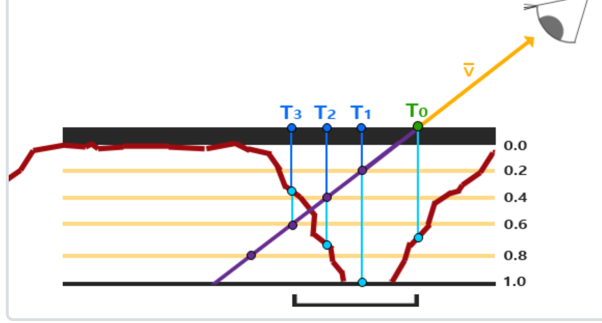
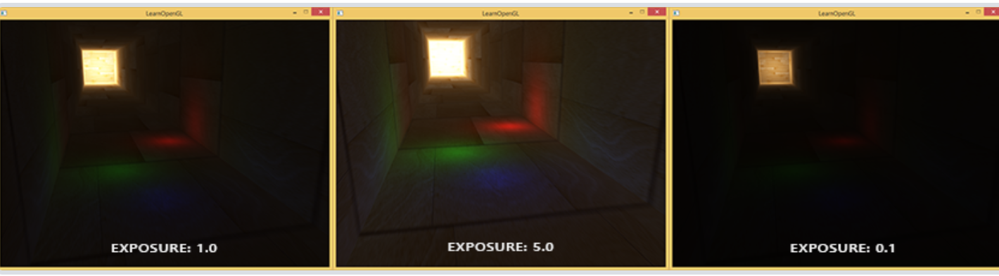

# 什么是OPENGL
1. 它仅仅是一个由Khronos组织制定并维护的规范(Specification)。
2. 严格规定了每个函数该如何执行，以及它们的输出值
3. 实际的OpenGL库的开发者通常是显卡的生产商

# 核心模式和立即模式
1. 早期的OpenGL使用立即渲染模式，固定渲染管线，不够灵活
2. 3.2开始使用核心模式：灵活效率高
3. 使用3.3因为核心架构没变

# 其他
1. 扩展：使用硬件支持的全新的现代特性

# 入门

## 窗口
### 关于glew-glad / glfw的实际工作
GLFW 提供 OpenGL, OpenGL ES 和 Vulkan 的桌面开发环境，是一个跨平台的开源库。
利用它可以创建窗口、处理键盘鼠标等事件。windows下它使用win32 api创建窗口，WGL关联OPENGL上下文。
Linux 下使用 X11创建窗口，GLX关联OPENGL上下文。MAC下使用cocoa创建窗口，AGL关联OPENGL上下文。
GLAD 的功能比较专一，专门加载OpenGL的函数指针。

窗口类的都是glfw..()，而实际渲染相关的代码是gl..()


## 三角形
### 管线
图形渲染管线接受一组3D坐标，通过着色器将之转变屏幕上的有色2D像素输出。
OpenGL着色器是用OpenGL着色器语言(OpenGL Shading Language, GLSL)写成的。


顶点着色器-形状装配-几何着色器-光栅化-片段着色器-测试与混合

1. **顶点着色器**(Vertex Shader)主要的目的是把3D坐标转为标准化设备坐标，同时顶点着色器允许我们对顶点属性进行一些基本处理。
2. **图元装配**(Primitive Assembly)阶段将顶点着色器输出的所有顶点作为输入（如果是GL_POINTS，那么就是一个顶点），并所有的点装配成指定图元的形状
3. **几何着色器**(Geometry Shader)把图元形式的一系列顶点的集合作为输入，它可以通过产生新顶点构造出新的（或是其它的）图元来生成其他形状。
4. **光栅化阶段**(Rasterization Stage)，这里它会把图元映射为最终屏幕上相应的像素，生成供片段着色器(Fragment Shader)使用的片段(Fragment)。
5. **裁切**(Clipping)。裁切会丢弃超出你的视图以外的所有像素，用来提升执行效率。
6. **片段着色器**的主要目的是计算一个像素的最终颜色，这也是所有OpenGL高级效果产生的地方。通常，片段着色器包含3D场景的数据（比如光照、阴影、光的颜色等等），这些数据可以被用来计算最终像素的颜色。
7. 在所有对应颜色值确定以后，最终的对象将会被传到最后一个阶段，我们叫做Alpha测试和混合(Blending)阶段。这个阶段检验某个像素深度以判断是否改被丢弃，并检查alpha值以混合。


### VBO
顶点缓冲对象存储顶点信息。每个类型可以绑定一个vbo
### 两个着色器的编译
我们需要自己写顶点着色器和几何着色器。
### 着色器程序
多个着色器合并之后并最终链接完成的版本
### 链接顶点属性
### VAO
可以像顶点缓冲对象那样被绑定，任何随后的顶点属性调用都会储存在这个VAO中。当配置顶点属性指针时，你只需要将那些调用执行一次，之后再绘制物体的时候只需要绑定相应的VAO就行了.
VAO也会自动绑定IBO


### GLSL
着色器的开头总是要声明版本，接着是输入和输出变量、uniform和main函数。

每个输入变量也叫顶点属性(Vertex Attribute)
### 数据类型
int、float、double、uint和bool，vector和matrix

#### vector

类型 	含义
vecn 	包含n个float分量的默认向量
bvecn 	包含n个bool分量的向量
ivecn 	包含n个int分量的向量
uvecn 	包含n个unsigned int分量的向量
dvecn 	包含n个double分量的向量

向量允许重组：vec4 otherVec = someVec.xxxx + anotherVec.yxzy;

### I/O
语法：
in/out type name;
每一级shader的out会进入下一级作为in，需要名称和类型相同。
对于顶点缓冲区，特别地需要layout(index)以表达顶点属性输入。
### uniform 变量
uniform type name; 此名称是全局的，并能够从cpu函数中修改。

## 纹理
我们需要指定三角形的每个顶点各自对应纹理的哪个部分。这样每个顶点就会关联着一个纹理坐标(Texture Coordinate)，用来标明该从纹理图像的哪个部分采样。之后在图形的其它片段上进行片段插值(Fragment Interpolation)。

将纹理的像素texel映射为纹理坐标的过程称作纹理过滤，以使其分辨率无关。
GL_NEAREST（也叫邻近过滤，Nearest Neighbor Filtering）是OpenGL默认的纹理过滤方式。
GL_LINEAR（也叫线性过滤，(Bi)linear Filtering）它会基于纹理坐标附近的纹理像素，计算出一个插值。
### 多级渐远纹理
为了形成远近清晰和模糊的分野，使用此方法

### 纹理单元
通过给sample2D变量（采样器）赋值设置多个纹理。一个纹理的位置值通常称为一个纹理单元。
## 变换
此章节内容参阅一般的图形学教材
## 坐标系统
比较重要的总共有5个不同的坐标系统：

    局部空间(Local Space，或者称为物体空间(Object Space))
    世界空间(World Space)
    观察空间(View Space，或者称为视觉空间(Eye Space))
    裁剪空间(Clip Space)
    屏幕空间(Screen Space)


1. 局部坐标是对象相对于局部原点的坐标，也是物体起始的坐标。
2. 下一步是将局部坐标变换为世界空间坐标，世界空间坐标是处于一个更大的空间范围的。这些坐标相对于世界的全局原点，它们会和其它物体一起相对于世界的原点进行摆放。
3. 接下来我们将世界坐标变换为观察空间坐标，使得每个坐标都是从摄像机或者说观察者的角度进行观察的。
4. 坐标到达观察空间之后，我们需要将其投影到裁剪坐标。裁剪坐标会被处理至-1.0到1.0的范围内，并判断哪些顶点将会出现在屏幕上。
5. 最后，我们将裁剪坐标变换为屏幕坐标，我们将使用一个叫做视口变换(Viewport Transform)的过程。视口变换将位于-1.0到1.0范围的坐标变换到由glViewport函数所定义的坐标范围内。最后变换出来的坐标将会送到光栅器，将其转化为片段。

### 局部空间
局部坐标即对象内部所使用的坐标
### 世界空间
众物体所在的空间。由局部空间到世界空间的变换是通过模型矩阵实现的。

模型矩阵是一种变换矩阵，它能通过对物体进行位移、缩放、旋转来将它置于它本应该在的位置或朝向。
### 观察空间
观察空间经常被人们称之OpenGL的摄像机(Camera)（所以有时也称为摄像机空间(Camera Space)或视觉空间(Eye Space)）。观察空间是将世界空间坐标转化为用户视野前方的坐标而产生的结果。因此观察空间就是**从摄像机的视角所观察到的空间**。而这通常是由一系列的位移和旋转的组合来完成，平移/旋转场景从而使得特定的对象被变换到摄像机的前方。这些组合在一起的变换通常存储在一个**观察矩阵**(View Matrix)里，它被用来将世界坐标变换到观察空间。
### 裁剪空间
（投影+归一化）
顶点着色器最后，期望所有的坐标都能落在一个特定的范围内，且任何在这个范围之外的点都应该被裁剪掉(Clipped)。被裁剪掉的坐标就会被忽略，所以剩下的坐标就将变为屏幕上可见的片段。这也就是裁剪空间(Clip Space)名字的由来。

我们会指定自己的坐标集(Coordinate Set)并将它变换回标准化设备坐标系，为了将顶点坐标从观察变换到裁剪空间，我们需要定义一个**投影矩阵**(Projection Matrix)，它指定了一个范围的坐标，比如在每个维度上的-1000到1000。投影矩阵接着会将在这个指定的范围内的坐标变换为标准化设备坐标的范围(-1.0, 1.0)。所有在范围外的坐标不会被映射到在-1.0到1.0的范围之间，所以**会被裁剪掉**。在上面这个投影矩阵所指定的范围内，坐标(1250, 500, 750)将是不可见的，这是由于它的x坐标超出了范围，它被转化为一个大于1.0的标准化设备坐标，所以被裁剪掉了。

由投影矩阵创建的观察箱(Viewing Box)被称为**平截头体**(Frustum)，每个出现在平截头体范围内的坐标都会最终出现在用户的屏幕上。将特定范围内的坐标转化到标准化设备坐标系的过程（而且它很容易被映射到2D观察空间坐标）被称之为**投影**(Projection)，因为使用投影矩阵能将3D坐标投影(Project)到很容易映射到2D的标准化设备坐标系中。
#### 投影：正射投影

#### 投影：透视投影

透视矩阵的求法参见http://www.songho.ca/opengl/gl_projectionmatrix.html

glm提供了perspective方法来求。
## 观察矩阵
lookat矩阵形如
，可以看出这个矩阵的作用是两部分：对原空间中的某个点P，

1. （先进行）右部分是平移使原空间和摄像机空间原点重合，因为摄像机的原点(Px,Py,Pz)变换之后成为0；
2. （再进行）换基。左边矩阵实际是基变换矩阵的转置（因为他是正规的，也是逆），以变换坐标。     

glm提供了lookAt方法来求。
# 光照
## 颜色
定义物体的颜色为物体从一个光源反射各个颜色分量的大小，
## 基础光照
phone模型：


    环境光照(Ambient Lighting)：即使在黑暗的情况下，世界上通常也仍然有一些光亮（月亮、远处的光），所以物体几乎永远不会是完全黑暗的。为了模拟这个，我们会使用一个环境光照常量，它永远会给物体一些颜色。
    漫反射光照(Diffuse Lighting)：模拟光源对物体的方向性影响(Directional Impact)。它是冯氏光照模型中视觉上最显著的分量。物体的某一部分越是正对着光源，它就会越亮。
    镜面光照(Specular Lighting)：模拟有光泽物体上面出现的亮点。镜面光照的颜色相比于物体的颜色会更倾向于光的颜色。
### 环境光照
1. 全局照明算法：考虑光的反射，代价高昂
2. 简化的模型：只用一个环境光强系数ambientStrength
### 漫反射
公式是 max(norm*lightDirection,0)， 即max(LN,0)。

注意需要对法向量做一个修正，即左乘model矩阵变换部分的转置的逆。这件事可以轻松地利用他两点乘是0推导。
### 镜面反射

公式是：max(reflect(lightdirection)*viewdirecton,0)再取一个反光度次幂，这个幂越大高光越小。

### 提示
光对这三种过程也应该具有不同的强度。

## 材质
在上述的phone过程中，我们定义了objectColor以表示物体的颜色。更加精细的做法是规定物体在环境光、漫反射和镜面反射时具有的不同的颜色向量。具体的说：

1. ambient材质向量定义了在环境光照下这个表面反射的是什么颜色，通常与表面的颜色相同。
2. diffuse材质向量定义了在漫反射光照下表面的颜色。漫反射颜色（和环境光照一样）也被设置为我们期望的物体颜色。
3. specular材质向量设置的是表面上镜面高光的颜色（或者甚至可能反映一个特定表面的颜色）。
4. shininess影响镜面高光的散射/半径。实际上就是上节课中说的幂。

## 光照贴图
一个物体具有多种材质的情况下需要引入新的贴图：漫反射（间接地，环境光）和镜面光贴图。漫反射贴图就是物体表面的颜色，也就是最开始介绍的贴图。镜面反射贴图主要对高光有用。

## 投光物
不同的光源产生有几种不同的光：距离无限远导致的平行光，比如太阳。或者一个点光源像四处发出衰减的光，光强公式满足
d代表了片段距光源的距离。接下来为了计算衰减值，我们定义3个（可配置的）项：常数项Kc、一次项Kl和二次项Kq

。

    常数项通常保持为1.0，它的主要作用是保证分母永远不会比1小，否则的话在某些距离上它反而会增加强度，这肯定不是我们想要的效果。
    一次项会与距离值相乘，以线性的方式减少强度。
    二次项会与距离的平方相乘，让光源以二次递减的方式减少强度。二次项在距离比较小的时候影响会比一次项小很多，但当距离值比较大的时候它就会比一次项更大了。
第三种光是聚光。它的光源只朝一个特定方向而不是所有方向照射光线。

    LightDir：从片段指向光源的向量。
    SpotDir：聚光所指向的方向。
    phi：指定了聚光半径的切光角。落在这个角度之外的物体都不会被这个聚光所照亮。
    theta：LightDir向量和SpotDir向量之间的夹角。在聚光内部的话θ值应该比ϕ值小。否则，使用
环境光。为了计算这点，使用一个cutoff定义为cos(phi)，如果内积比这个小就说明不在范围内。

聚光还需要考虑一个平滑的边缘。为此设置一组内外圆锥，外圆锥夹角gamma角度大于内圆锥夹角（一般设置为上文的phi）的
光得到新的强度I = cos(theta) - cos(phi) / cos(theta) - cos(gamma),换言之就是根据cos的差值。而cos
实际上就是两边向量内积。


# 高级opengl内容
## 深度测试
在大部分的系统中，深度缓冲的精度都是24位的。当深度测试(Depth Testing)被启用的时候，OpenGL会将一个**片段**的深度值与深度缓冲的内容进行对比。
OpenGL会执行一个深度测试，如果这个测试通过了的话，深度缓冲将会**更新为新的深度值**。如果深度测试失败了，片段将会被丢弃。
**测试是在片段着色器以及模板测试(Stencil Testing)运行之后在屏幕空间中运行的**。

屏幕空间坐标与通过OpenGL的glViewport所定义的视口密切相关，
并且可以直接使用GLSL内建变量gl_FragCoord从片段着色器中直接访问。
gl_FragCoord的x和y分量代表了片段的屏幕空间坐标（其中(0, 0)位于左下角）。
gl_FragCoord中也包含了一个**z分量，它包含了片段真正的深度值。**
z值就是需要与深度缓冲内容所对比的那个值。

现在大部分的GPU都提供一个叫做提前深度测试(Early Depth Testing)的硬件特性。提前深度测试允许深度测试在片段着色器之前运行。只要我们清楚一个片段永远不会是可见的（它在其他物体之后），我们就能提前丢弃这个片段。

一个例子是，如果深度测试的行为是“全部通过”，那么后渲染的物体会通过并且成为新的深度值，所以最后绘制的片段将会总是会渲染在之前绘制片段的上面

从投影矩阵来看，深度值（也是精度）与z呈现出非线性的关系，与1/z更近似。这个值是从[-1,1]\(NDC\)变化来的，即（NDC + 1）/2.

//使用glDepthFunc设置深度测试通过方式，默认GL_Less（在片段深度值小于缓冲的深度值时通过测试）

//glDepthFunc(GL_LESS);

### 防止深度冲突
摆的很近的时候深度缓冲没有足够的精度来决定两个形状哪个在前面，结果就是这两个形状不断地在切换前后顺序，这会导致很奇怪的花纹。
1. 永远不要把多个物体摆得太靠近，以至于它们的一些三角形会重叠。
2. 尽可能将近平面设置远一些。
3. 使用更高精度的深度缓冲。

## 模板测试
当片段着色器处理完一个片段之后，模板测试(Stencil Test)会开始执行，使用模板缓冲并可能会丢弃片段。一个模板缓冲中，（通常）每个模板值(Stencil Value)是8位的。所以每个像素/片段一共能有256种不同的模板值。

// 设置模板掩码在写入缓冲区时计算

// glStencilMask(0xFF); // 每一位写入模板缓冲时都保持原样

//glStencilMask(0x00); // 每一位在写入模板缓冲时都会变成0（禁用写入）

// 通过方式/参考值/掩码

// glStencilFunc(GL_EQUAL, 1, 0xFF);

// glStencilOp 设置测试的后果.具体参阅教程
### 物体轮廓
模板测试能够实现的一个功能是物体轮廓，过程如下：

    在绘制（需要添加轮廓的）物体之前，将模板函数设置为GL_ALWAYS，每当物体的片段被渲染时，将模板缓冲更新为1。
    渲染物体。
    禁用模板写入以及深度测试。
    将每个物体缩放一点点。
    使用一个不同的片段着色器，输出一个单独的（边框）颜色。
    再次绘制物体，但只在它们片段的模板值不等于1时才绘制。
    再次启用模板写入和深度测试。

## 混合
混合(Blending)通常是实现物体透明度(Transparency)的一种技术。透明就是说一个物体（或者其中的一部分）不是纯色(Solid Color)的，它的颜色是物体本身的颜色和它背后其它物体的颜色的不同强度结合。

一个物体的透明度是通过它颜色的alpha值来决定的。alpha即不透明度。其方程就是简单的
color = alpha1\*color1 + (1-alpha1)\*color2，但是opengl使用
color = F1\*color1 + F2\*color2，这个F是一个因子表征着颜色或者alpha等等对颜色的影响，使用glBlendFunc设置。

Tips:
，当采样纹理的边缘的时候，OpenGL会对边缘的值和纹理下一个重复的值进行插值（因为我们将它的环绕方式设置为了GL_REPEAT。这通常是没问题的，但是由于我们使用了透明值，纹理图像的顶部将会与底部边缘的纯色值进行插值。
这样的结果是一个半透明的有色边框,使用GL_CLAMP_TO_EDGE对GL_TEXTURE_WRAP_S。

// 公式1 即glBlendFunc(GL_SRC_ALPHA, GL_ONE_MINUS_SRC_ALPHA);

 为了解决混合与深度测试冲突的问题，从后向前渲染。

## 面剔除
提升渲染效率可以丢弃一些不可见面。规定一个对于观察者渲染的方向是正向，比如默认的逆时针，
他的背面的图元将以顺时针方向渲染。函数是
glEnable(GL_CULL_FACE);
glCullFace(GL_FRONT);

## 帧缓冲
其实就是屏幕显示画面的缓冲，换句话说缓冲结合起来叫做帧缓冲(Framebuffer)，它被储存在内存中。
目前所做的所有操作都是在窗口给我们建立的默认帧缓冲的渲染缓冲上进行的。实际上我们还可以自己建立
一些帧缓冲方便用。

一个完整的帧缓冲需要满足以下的条件：

    附加至少一个缓冲（颜色、深度或模板缓冲）。
    至少有一个颜色附件(Attachment)。
    所有的附件都必须是完整的（保留了内存）。
    每个缓冲都应该有相同的样本数。
   **附件**是一个内存位置，它能够作为帧缓冲的一个缓冲，可以将它想象为一个图像（颜色图，深度图，模型图……）。
    创建一个附件的时候我们有两个选项：纹理或渲染缓冲对象。

完成之后，调用glCheckFramebufferStatus，检查帧缓冲是否完整。成功之后渲染操作就可以在附件当中进行而不再在默认帧缓冲屏幕上进行，
因此这种方式也被称为离屏渲染(Off-screen Rendering)。

离屏渲染之后，如果想要让屏幕呈现结果只相当于绘制已经做好存放在附件中的贴图四边形（长方形）而已。因此，他不需要深度测试。
切换回默认的framebuffer之后再使用一个coord = (posx,posy, 0, 1)和color = texture(coord)的着色器渲染6个顶点即可。
### 纹理附件
把一个纹理（颜色/ 深度/ 模板) 附加到帧缓冲的时候，所有的渲染指令将会写入到这个纹理中，就像它是一个普通的颜色/深度或模板缓冲一样，
结果是所有渲染操作的结果将会被储存在一个纹理图像中，我们之后可以在着色器中很方便地使用它。创建纹理时我们绑定null，并
（一般）设置大小为视口大小。
并用glFramebufferTexture2D附着给帧缓冲。

### 渲染缓冲对象附件
他是在纹理之后引入到OpenGL中的。
render buffers这种对象也能像纹理附件一样渲染，但他会将数据储存为OpenGL原生的渲染格式，不会做任何针对纹理格式的转换，因此更快。


因为它的数据已经是原生的格式了，当写入或者复制它的数据到其它缓冲中时是非常快的。
所以，交换缓冲这样的操作在使用渲染缓冲对象时会非常快。我们在每个渲染迭代最后使用的glfwSwapBuffers，
也可以通过渲染缓冲对象实现：只需要写入一个渲染缓冲图像，并在最后交换到另外一个渲染缓冲就可以了。


### 后期处理
将一帧做成贴图之后，就可以在片段着色器中进行后期处理了。比如反相，只需要1-texture(coord)
或者让一个核作用在图像上。

一些可以使用的核参考原文。

## 正方体贴图
立方体贴图就是一个包含了6个2D纹理的纹理，每个2D纹理都组成了立方体的一个面：一个有纹理的立方体。
只需要提供一个3d向量就能获得纹理值。
### 天空盒
天空盒是一个包含了整个场景的（大）立方体，它包含周围环境的6个图像，让玩家以为他处在一个比实际大得多的环境当中。
加载时适用GL_TEXTURE_CUBE_MAP，需要注意两点：
1. 读的顺序：当按照 { ..., front.jpg , back.jpg } 的顺序加载纹理图片，
素材中的 back.jpg 实际上贴在 cube 的 negtive z 面（摄像机朝“前方”（-z 方向）看时，看到的就是 back.jpg ）所以应该是back, front
2. cubemap扫描的时候是从左上角开始的，（一般的纹理是左下角）。

天空盒所使用的着色器的特点是位置向量作为输出给片段着色器的纹理坐标。
### 天空盒优化
因为首先渲染天空盒将对屏幕全部图元进行着色，更好的方式是将他放在后面渲染。实现这点的一个
方式是提前深度测试。

总之首先我们需要让顶点shader的最后给天空盒顶点的NDC.z = 1，即认为天空盒是最深的地方。而由于透视除法
是在顶点着色器之后进行的，因此顶点着色器中令gl_pos = pos.xyww。并且由于深度缓冲被初始化为1，
就不再在那些缓冲区不为1（换言之，已经有画过被的物体）的地方运行面着色器。因此在绘制天空盒时只有当缓冲区
的值是初始值时通过，也就是equal这种方法。
### 环境映射
通过使用环境的立方体贴图，我们可以给物体反射和折射的属性。
这样使用环境立方体贴图的技术叫做环境映射(Environment Mapping)，其中最流行的两个是反射(Reflection)和折射(Refraction)。

#### 反射和折射
物体的颜色相当于天空盒发光，经过镜面反射得到。更加高级的做法动态贴图则相当于这一帧的六个角度创建的纹理经过反射得到的。


## 高级数据结构
本节是对各种接口的介绍。
1. 使用glBufferSubData将数据直接复制到缓冲中，这样可以使用分批顶点属性。
2. 使用glCopyBufferSubData复制缓冲，之前需要bind两个buffer：GL_COPY_READ_BUFFER和GL_COPY_WRITE_BUFFER

## 高级GLSL
### 自建变量
#### Vertex shader
1. gl_Position，输出变量。顶点着色器的裁剪空间输出位置向量，需要glEnable(GL_PROGRAM_POINT_SIZE);
2. gl_PointSize，输出变量，渲染出来的点的大小。
3. gl_VertexID，输入变量，储存了正在绘制顶点的当前ID。当（使用glDrawElements）进行索引渲染的时候，这个变量会存储正在绘制顶点的当前索引。当（使用glDrawArrays）不使用索引进行绘制的时候，这个变量会储存从渲染调用开始的已处理顶点数量。
4. 
#### fragment shader
1. gl_FragCoord，输入变量，x和y分量是片段的窗口空间(Window-space)坐标，其原点为窗口的左下角，范围是0-窗口大小。z是对应片段的深度值，0-1（由标准设备坐标（x+1）/2得到）.
2. gl_FrontFacing，输入变量，当前片段是属于正向面的一部分还是背向面的一部分。
3. gl_FragDepth，输出变量，修改z值，否则使用gl_FragCoord.z。对gl_FragDepth写入会导致禁用所有的提前深度测试。

3.1 深度条件：使用layout (depth_\<condition>) out float gl_FragDepth;重新声明gl_FragDepth变量以保留一些提前深度测试。这个条件
约束了对于gl_fragdepth写入的行为，例如如果填greater就声明只会写入更深的。

### 接口块 Interface Block
类似于结构体，并可以定义他是in或out的，以完成对输入输出的批量管理。

### Uniform缓冲对象
允许我们定义一系列在多个着色器中相同的全局Uniform变量。例如说project矩阵和view矩阵一般是跨shader相同的，将之存到uniform block中如
```
layout (std140) uniform Matrices
{
    mat4 projection;
    mat4 view;
};

```
在opengl中，每个元素的大小是和c++相对应的，但是并没有声明这些变量的边距（对齐等等），这件事可以由硬件决定。
默认情况使用的内存布局是共享，指硬件将会跨程序使用相同的布局。但是这样的话是没法按直接方法获得偏移量的，只能使用
其他方法填充如glGetUniformIndices查询每个变量的偏移。

通常的做法是，不使用共享布局，而是使用std140布局。std140布局声明了每个变量的偏移量都是由一系列规则所决定的
，这显式地声明了每个变量类型的内存布局。由于这是显式提及的，我们可以手动计算出每个变量的偏移量。
#### 常见的布局规则
packed：不仅不同OpenGL实现存在布局差异，不同program也可能存在布局差异
shared：（默认）不同OpenGL实现存在布局差异，不同program如果使用相同定义没有布局差异
std140：不同OpenGL实现不存在布局差异。

#### std140规则
位于std140布局的Uniform Block中的每个结构体按照它们在Uniform Block中出现的**顺序存储**。每个结构体及其成员对应有一个**基偏移**(base offset)和**基对齐**(base alignment)。对齐偏移由基偏移向上偏移满足偏移为基对齐的整数倍得到。结构体第一个成员的基偏移为结构体本身的基偏移，其它成员的基偏移由其上一个成员的对齐偏移加上上一个成员的机器大小再加1得到。Uniform Block的第一个成员基偏移为0。

    1.如果成员是一个大小为N个机器单位的标量，它的基对齐为N。
    2.如果成员是一个包含有2个元素或4个元素，每个元素大小为N个机器单位的向量，它的基对齐为2N或4N。
    3.如果成员是一个包含有3个元素，每个元素大小为N个机器单位的向量，它的基对齐为4N。
    4.如果成员是一个标量或向量数组，数组中的每个元素满足规则1，2，3，数组元素的基对齐向上扩充到vec4同样大小。数组尾部可能包含用于补齐的空白，数组之后的第一个成员的基偏移向上偏移到下一个基对齐的倍数。
    5.如果成员是一个列主序的C列R行矩阵，矩阵的存储方式和C个每个元素为包含R个元素的向量数组按照规则4存储相同。
    6.如果成员是一个列主序的S个C列R行矩阵数组，矩阵的存储方式和S x C个每个元素为包含R个元素的向量数组按照规则4存储相同。
    7.如果成员是一个行主序的C列R行矩阵，矩阵的存储方式和R个每个元素为包含C个元素的向量数组按照规则4存储相同。
    8.如果成员是一个行主序的S个C列R行矩阵数组，矩阵的存储方式和S x R个每个元素为包含C个元素的向量数组按照规则4存储相同。
    如果成员是一个结构体，它的基对齐和vec4相同。结构体内的成员递归按照规则1-10存储。结构体的第一个成员的偏移对齐等于结构体的偏移对齐。结构体的尾部可能包含有用于补齐的空白，紧接结构体的下一个成员的基偏移向上偏移到结构体的下一个基对齐。
    9.如果成员是一个包含S个元素的结构体数组，这S个元素按照规则9依次存储。

每个变量都有一个基准对齐量(Base Alignment)，它等于一个变量在Uniform块中所占据的空间（包括填充量(Padding)），这个基准对齐量是使用std140布局的规则计算出来的。接下来，对每个变量，我们再计算它的对齐偏移量(Aligned Offset)，
它是一个变量从块起始位置的字节偏移量。一个变量的对齐字节偏移量必须等于基准对齐量的倍数。

uniform block 与 buffer的绑定方式是通过绑定点进行的。,需要glUniformBlockBinding函数，参数是
(shaderid,idx,绑定点)，idx通过glGetUniformBlockIndex(程序，名称)

## 几何着色器
几何着色器在顶点着色器之后进入。使用需要遵守一些原则：
1.在几何着色器的顶部，我们需要声明从顶点着色器输入的图元类型，这需要在in关键字前声明一个布局修饰符(Layout Qualifier)。这个输入布局修饰符可以从顶点着色器接收下列任何一个图元值：
    
    points：绘制GL_POINTS图元时（1）。
    lines：绘制GL_LINES或GL_LINE_STRIP时（2）
    lines_adjacency：GL_LINES_ADJACENCY或GL_LINE_STRIP_ADJACENCY（4）
    triangles：GL_TRIANGLES、GL_TRIANGLE_STRIP或GL_TRIANGLE_FAN（3）
    triangles_adjacency：GL_TRIANGLES_ADJACENCY或GL_TRIANGLE_STRIP_ADJACENCY（6）
2. 还需要指定几何着色器输出的图元类型，对out 使用layout（）可选：
    
    points
    line_strip
    triangle_strip
并可以指定max_vertices = 2以限制最大顶点。
3. 他的作用是将一个顶点等等画成另外一个图元，比如一个点变成一个小三角。这可以
用在一些新奇效果上，并且总比输入顶点来得快。

4. 可以使用名字gl_in的内建变量来找到输入的全部顶点，他像是：
```
in gl_Vertex
{
    vec4  gl_Position;
    float gl_PointSize;
    float gl_ClipDistance[];
} gl_in[];
```
5. 使用2个几何着色器函数，EmitVertex和EndPrimitive，来生成新的数据。在计算出内建变量
6. gl_Position后就EmitVertex这个顶点，并（可以）使用EndPrimitive()合成这些顶点以生成如三角形的图元。

### 爆破效果
将每个三角形沿着法向量的方向移动一小段时间，效果就是，整个物体看起来像是沿着每个三角形的法线向量爆炸一样

具体参阅教程，注意接口块跨shader需要声明变量名不同但是（块名和内容）相同的接口块。
以及参阅教程中的法线绘制。

## 实例化
在绘制大量重复实例的时候使用，以避免在代码层面使用for循环来渲染，因为使用drawelements会导致多次cpu-gpu的工作
比较慢。将glDrawArrays和glDrawElements的渲染调用分别改为glDrawArraysInstanced和glDrawElementsInstanced就可以
实现1次通信渲染很多实例。

这样渲染同一个实例时cpu提供的数据都是相同的，需要之前就给好uniform数组，并使用gl内建变量gl_InstanceID.
### 实例化数组
上文中使用uniform数组的方法不太行，因为这种设计uniform的数量是有限的。它的一个代替方案是实例化数组(Instanced Array)，
它被定义为一个顶点属性，仅在顶点着色器渲染一个新的实例时才会更新，需要调用
glVertexAttribDivisor。这个函数告诉了OpenGL该什么时候更新顶点属性的内容至新一组数据
。它的第一个参数是需要的顶点属性，第二个参数是属性除数(Attribute Divisor)。默认情况下，属性除数是0，告诉OpenGL我们需要在顶点着色器的每次迭代时更新顶点属性。将它设置为1时，我们告诉OpenGL我们希望在渲染一个新实例的时候更新顶点属性。而设置为2时，我们希望每2个实例更新一次属性，以此类推。
我们将属性除数设置为1，是在告诉OpenGL，处于位置值2的顶点属性是一个实例化数组。

## 抗锯齿
边缘出现锯齿状渲染称为“走样”Aliasing。有多种技术可以Anti走样：
1. 超采样抗锯齿(Super Sample Anti-aliasing, SSAA)，先以更高分辨率
渲染场景，再下采样
2. 多重采样抗锯齿(Multisample Anti-aliasing, MSAA)。

光栅器是位于最终处理过的顶点之后到片段着色器之前所经过的所有的算法与过程的总和。光栅器会将一个图元的所有顶点作为输入，并将它转换为一系列的片段。顶点坐标理论上可以取任意值，但片段不行，因为它们受限于你窗口的分辨率。顶点坐标与片段之间几乎永远也不会有一对一的映射，
所以光栅器必须以某种方式来决定每个顶点最终所在的片段/屏幕坐标。

如图中像素格子和中心的采样点是用来判断这个像素是否属于这个三角形内部。这导致了渲染结果：


### MSAA
多重采样做的是将单一的采样点变为多个采样点。我们将用这些子采样点来决定像素的遮盖度。当然，这也意味着颜色缓冲的大小会随着子采样点的增加而增加。

MSAA决定像素颜色只需要运行一次片段着色器，即使用像素中心的那个顶点，得到的结果颜色
存储在每个遮盖的子采样点中。当颜色缓冲的子样本被图元的所有颜色填满时，所有的这些颜色将会在每个像素内部平均化。因为上图的4个采样点中只有2个被遮盖住了，这个像素的颜色将会是三角形颜色与其他两个采样点的颜色（在这里是无色）的平均值，最终形成一种淡蓝色。
### MSAA 在opengl中
在窗口创建前hint，并glEnable(GL_MULTISAMPLE);
### 离屏MSAA
有两种方式可以创建多重采样缓冲，将其作为帧缓冲的附件：纹理附件和渲染缓冲附件，如帧缓冲处所叙述。
#### 使用纹理附件MSAA
glBindTexture(GL_TEXTURE_2D_MULTISAMPLE, tex);
glTexImage2DMultisample(GL_TEXTURE_2D_MULTISAMPLE, samples, GL_RGB, width, height, GL_TRUE);
glBindTexture(GL_TEXTURE_2D_MULTISAMPLE, 0);
并使用
glFramebufferTexture2D(GL_FRAMEBUFFER, GL_COLOR_ATTACHMENT0, GL_TEXTURE_2D_MULTISAMPLE, tex, 0);
#### 使用渲染缓冲附件MSAA
使用
glRenderbufferStorageMultisample(GL_RENDERBUFFER, 4, GL_DEPTH24_STENCIL8, width, height);
而非glRenderbufferStorage。

# 光照
## blinn phong模型
但是它的镜面反射会在一些情况下出现问题，特别是物体反光度很低时，会导致大片（粗糙的）高光区域。
而且会有一道明显的分界线。原因是：phone模型当观察向量和反射向量间的夹角>90度就会将镜面光分量置0，而
事实上这点在反光度比较小的物体上的作用是比较显著的，以至于形成一道分界线。

Blinn-Phong模型不再依赖于反射向量，而是采用了所谓的半程向量(Halfway Vector)，即光线与视线夹角一半方向上的一个单位向量。当半程向量与法线向量越接近时，镜面光分量就越大。
它与法线的夹角就是视线和反射光夹角的一半。
## gamma修正

Gamma也叫灰度系数，每种显示设备都有自己的Gamma值。
设备输出亮度 = 电压的Gamma次幂，对于CRT，Gamma通常为2.2，因而，输出亮度 = 输入电压的2.2次幂。
为什么是2.2？
人需要按照上边的方式感知灰度，这个表是按照人的感知来分成十个等级的灰。而物理
亮度（光子数）确是按照下面图的形式，给4倍与0.1的光子对人来说已经是第7级的灰了（人类对灰的认知分辨能力更强）。


如果我们认为颜色向量代表不同原色的亮度，那么这个亮度为了使得在人眼中呈现一个线性关系，
显示器不能简单地给出一个线性的电压调整。一个好看的数值是2.2。如图实线所示，
一个人眼颜色0.5在变成人眼颜色1以后，光子数实际上从0.2调整到了1。sRGB空间使用的gamma也是2.2，也就是说线性空间中的0.5
到了sRGB空间中就是0.2。
因此，为了迎合显示器的这一调整，我们使用光照算法（在线性空间中计算）应当将结果变成短划线所示，以在crt修正后
符合正确的物理规律。
只需
glEnable(GL_FRAMEBUFFER_SRGB);或者在fragmentshader中，计算
float gamma = 2.2;
    fragColor.rgb = pow(fragColor.rgb, vec3(1.0/gamma));

而关于艺术家的创作，他们是在srgb空间中进行的，已经考虑了gamma矫正，无需二次矫正。
### 衰减
在开启gamma矫正后，我们进行的都是依据在物理世界进行，实际上光是二次衰减的，也因此使用二次衰减效果更好。
但不开启gamma矫正时使用1/x效果更好，这是因为gamma矫正后成为1/x^2.2，比较贴合现实。

# 阴影
## 阴影映射
阴影映射由两个步骤组成：首先，我们渲染深度贴图，然后我们像往常一样渲染场景，使用生成的深度贴图来计算片段是否在阴影之中。

深度贴图：从光的透视图里渲染的深度纹理，使用帧缓冲的深度缓冲区。需要的只是在从光的透视图下渲染场景的时候深度信息，所以颜色缓冲没有用。然而，不包含颜色缓冲的帧缓冲对象是不完整的，所以我们需要显式告诉OpenGL我们不适用任何颜色数据进行渲染。通过将调用glDrawBuffer和glReadBuffer把读和绘制缓冲设置为GL_NONE来做这件事

glDrawBuffer:


glBindFramebuffer:
将名称为framebuffer 的帧缓冲区对象绑定到由target 指定的帧缓冲区目标。目标必须是 GL_DRAW_FRAMEBUFFER、GL_READ_FRAMEBUFFER 或 GL_FRAMEBUFFER。如果帧缓冲区对象绑定到 GL_DRAW_FRAMEBUFFER 或 GL_READ_FRAMEBUFFER，则它分别成为渲染或读回操作的目标，直到它被删除或另一个帧缓冲区绑定到相应的绑定点。调用 glBindFramebuffer 将目标设置为 GL_FRAMEBUFFER 将帧缓冲区绑定到读取和绘制帧缓冲区目标。 Framebuffer 是先前从调用 glGenFramebuffers 返回的帧缓冲区对象的名称，或者为零以破坏帧缓冲区对象与目标的现有绑定。
## 阴影失真：线条

因为阴影贴图受限于分辨率，在距离光源比较远的情况下，多个片段可能从深度贴图的同一个值中去采样。我们可以用一个叫做阴影偏移（shadow bias）的技巧来解决这个问题. 也就是认为表面的深度值要略小一个bias(current - bias > depth == shadow). bias可以通过法线与光照的关系指定，比如

float bias = max(0.05 * (1.0 - dot(normal, lightDir)), 0.005);


## 阴影失真：悬浮
偏移有可能足够大，以至于可以看出阴影相对实际物体位置的偏移。我们可以使用一个叫技巧解决大部分的Peter panning问题：当渲染深度贴图时候使用正面剔除（front face culling）。


## 采样过多
深度贴图大小以外，光视锥以内的点纹理默认设置repeat，就又重新采样一次。使用GL_CLAMP_TO_BORDER并设置为1.0可以使他不会处于阴影当中。

另外，在光的视锥范围之外，深度值大于1，可以让这部分的点shadow=0.

## PCF（percentage-closer filtering）
这是一种多个不同过滤方式的组合，它产生柔和阴影，使它们出现更少的锯齿块和硬边。核心思想是从深度贴图中多次采样，每一次采样的纹理坐标都稍有不同。每个独立的样本可能在也可能不再阴影中。所有的次生结果接着结合在一起，进行平均化，我们就得到了柔和阴影。


# 点光源阴影
和上面的阴影类似，只是深度变为了6个方向，所以用方体贴图CubeMap. 这里的技巧是使用几何着色器，负责将所有世界空间的顶点变换到6个不同的光空间。

## PCF
在方向的末端多采样附近几个方向的点，最后取平均。这可能会导致阴影重叠。


# 法线贴图
可视化模型的法线得到图


如果制作者设置法线贴图始终偏向z方向 (0,0,1)，这在物体表面法线并不向z轴时发生错误！

需要在另一个空间（切空间）中处理法线。在切空间中，+z方向和表面的法线向量对齐。使用一个特定的矩阵我们就能将本地/切线空间中的法线向量转成世界或视图空间下。

TBN（tangent、bitangent和normal）是将UV坐标中的图元三角形到世界坐标图元三角形的映射。具体求解通过计算


最后公式如下。


这里还可以考察基变换矩阵。

原先向量的坐标是($\Delta u_1,\Delta v_1$)，后来的坐标是E1，要求基向量在R3下的坐标也就是这个C。


1. 我们直接使用TBN矩阵，这个矩阵可以把切线坐标空间的向量转换到世界坐标空间。因此我们把它传给片段着色器中，把通过采样得到的法线坐标左乘上TBN矩阵，转换到世界坐标空间中，这样所有法线和其他光照变量就在同一个坐标系中了。
2. 我们也可以使用TBN矩阵的逆矩阵，这个矩阵可以把世界坐标空间的向量转换到切线坐标空间。因此我们使用这个矩阵左乘其他光照变量，把他们转换到切线空间，这样法线和其他光照变量再一次在一个坐标系中了。这种方法比较好，因为他在顶点着色器中就把光源等等变化到了切线空间中，少使用了一次矩阵乘法。

但是Assimp就已经执行了这个操作。

当在更大的网格上计算切线向量的时候，它们往往有很大数量的共享顶点，当法向贴图应用到这些表面时将切线向量平均化通常能获得更好更平滑的结果。这样做有个问题，就是TBN向量可能会不能互相垂直，这意味着TBN矩阵不再是正交矩阵了。法线贴图可能会稍稍偏移，通过重正交化方法改进。

# 视差贴图 Parallax mapping
视差贴图属于位移贴图(Displacement Mapping)技术的一种，对根据储存在纹理中的几何信息对顶点进行位移或偏移。


如果平面进行实际位移，观察者会在点B看到表面。然而我们的平面没有实际上进行位移，观察方向将在点A与平面接触。视差贴图的目的是，**在A位置上的fragment不再使用点A的纹理坐标而是使用点B的**。随后我们用点B的纹理坐标采样，观察者就像看到了点B一样。

获得B纹理坐标的技巧：将向量V缩放到H(A)，得到向量P，以他与平面对齐的坐标作为纹理坐标的偏移量。

问题：1. 高度变化很快时不真实
2.当表面被任意旋转以后很难指出从P¯获取哪一个坐标。


2的解决：通过到切空间


用反色高度贴图（也叫深度贴图，用1-采样值得到高度）去模拟深度比模拟高度更容易。这次是A的纹理坐标 - V得到了P。


将fragment和观察者都发到切空间，方便采样法线和高度。在像素着色器中实现逻辑。问题是使用哪里的纹理坐标？ParallaxMapping把fragment的纹理坐标和切线空间中的fragment到观察者的方向向量为输入。这个函数返回经位移的纹理坐标。
```c
vec2 ParallaxMapping(vec2 texCoords, vec3 viewDir)
{ 
    float height =  texture(depthMap, texCoords).r;    
    vec2 p = viewDir.xy / viewDir.z * (height * height_scale);
    return texCoords - p;    
}
```
height_scale是一些额外的控制。

有一个地方需要注意，就是除以viewDir.z的目的：
因为viewDir向量是经过了标准化的，viewDir.z会在0.0到1.0之间的某处。当viewDir大致平行于表面时，它的z元素接近于0.0，除法会返回比viewDir垂直于表面的时候更大的P¯向量。所以，从本质上，相比正朝向表面，**当带有角度地看向平面时，我们会更大程度地缩放P¯的大小，从而增加纹理坐标的偏移**；这样做在视角上会获得更大的真实度。有些人更喜欢不在等式中使用viewDir.z，因为普通的视差贴图会在角度上产生不尽如人意的结果；这个技术叫做有偏移量限制的视差贴图（Parallax Mapping with Offset Limiting）。

问题：边缘纹理坐标超出了0到1的范围进行采样，根据纹理的环绕方式导致了不真实的结果；

在陡峭的高度上不真实。


## 陡峭视差映射
陡峭视差映射(Steep Parallax Mapping)是视差映射的扩展，原则是一样的，但不是使用一个样本而是多个样本来确定向量P¯到B。即使在陡峭的高度变化的情况下，它也能得到更好的结果，原因在于该技术通过增加采样的数量提高了精确性。陡峭视差映射的基本思想是将总深度范围划分为同一个深度/高度的多个层。从每个层中我们沿着P¯方向移动采样纹理坐标，直到我们**找到一个采样低于当前层的深度值**。比如T3是layer * x < Texture(depthMap, fragpos - P*x);


当垂直看一个表面的时候纹理时位移比以一定角度看时的小。我们可以在垂直看时使用更少的样本，以一定角度看时增加样本数量：

陡峭视差贴图同样有自己的问题。因为这个技术是基于有限的样本数量的，我们会遇到锯齿效果以及图层之间有明显的断层：


## 视差遮蔽映射
视差遮蔽映射(Parallax Occlusion Mapping)和陡峭视差映射的原则相同，但不是用触碰的第一个深度层的纹理坐标，而是在触碰之前和之后，在这两个纹理坐标进行线性插值。这个比例是
afterDepth / (afterDepth - beforeDepth);


# HDR
HDR(High Dynamic Range, 高动态范围)。HDR渲染和其很相似，我们允许用更大范围的颜色值渲染从而获取大范围的黑暗与明亮的场景细节，最后将所有HDR值转换成在[0.0, 1.0]范围的LDR(Low Dynamic Range,低动态范围)。转换HDR值到LDR值得过程叫做色调映射(**Tone Mapping**)，现在现存有很多的色调映射算法，这些算法致力于在转换过程中保留尽可能多的HDR细节。这些色调映射算法经常会包含一个选择性倾向黑暗或者明亮区域的参数。

在实时渲染中，HDR不仅允许我们超过LDR的范围[0.0, 1.0]与保留更多的细节，同时还让我们能够根据光源的真实强度指定它的强度。比如太阳有比闪光灯之类的东西更高的强度，那么我们为什么不这样子设置呢?(比如说设置一个10.0的漫亮度) 这允许我们用更现实的光照参数恰当地配置一个场景的光照，而这在LDR渲染中是不能实现的，因为他们会被上限约束在1.0。

方法：使用浮点帧缓冲渲染出float>1的场景，然后再（类似后处理）用这个color作为纹理渲染一个方块。

## 浮点帧缓冲
当帧缓冲使用了一个标准化的定点格式(像GL_RGB)为其颜色缓冲的内部格式，OpenGL会在将这些值存入帧缓冲前自动将其约束到0.0到1.0之间。这一操作对大部分帧缓冲格式都是成立的，除了专门用来存放被拓展范围值的浮点格式。

想要创建一个浮点帧缓冲，我们只需要改变颜色缓冲的内部格式参数就行了.
## 色调映射
色调映射(Tone Mapping)是一个损失很小的转换浮点颜色值至我们所需的LDR[0.0, 1.0]范围内的过程，通常会伴有特定的风格的色平衡(Stylistic Color Balance)。比如最简单的

// **Reinhard色调映射**
    vec3 mapped = hdrColor / (hdrColor + vec3(1.0));
这个算法是倾向明亮的区域。


这个图片清晰地展示了HDR渲染的优点。通过改变曝光等级，我们可以看见场景的很多细节


# 泛光


实现：提取超过一定亮度的fragment，进行模糊。
## 提取
使用MRTMultiple Render Targets，多渲染目标）的技巧，指定一个像素着色器多个输出。

阈值：float brightness = dot(FragColor.rgb, vec3(0.2126, 0.7152, 0.0722));
    if(brightness > 1.0)
        BrightColor = vec4(FragColor.rgb, 1.0);

这在HDR中是比较好用的，因为颜色可以超过1.0，避免了亮部过多的问题。

## 高斯模糊
如果使用二维四方形作为权重需要大量计算。高斯方程有个非常巧妙的特性，它允许我们把二维方程分解为两个更小的方程：一个描述水平权重，另一个描述垂直权重。我们首先用水平权重在整个纹理上进行水平模糊，然后在经改变的纹理上进行垂直模糊。利用这个特性，结果是一样的，但是可以节省难以置信的性能，因为我们现在只需做32+32次采样。**两步高斯模糊**，或者被称为Ping-pong.


代码：


## 混合纹理

# 延迟渲染
现在使用的是正向着色法，在场景中我们根据所有光源照亮一个物体，之后再渲染下一个物体，以此类推。
